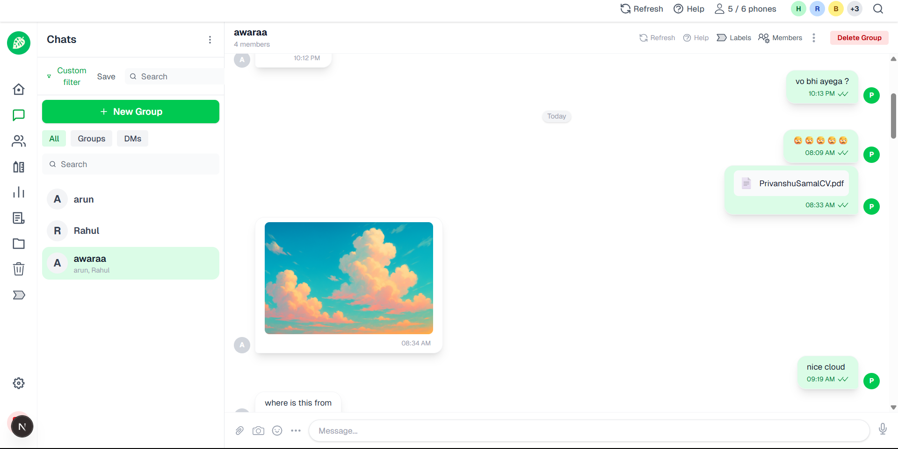
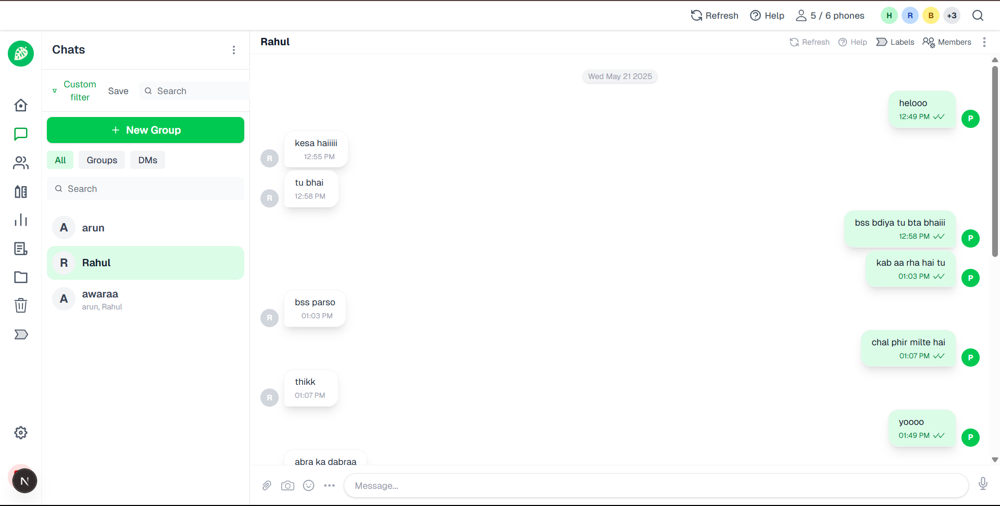
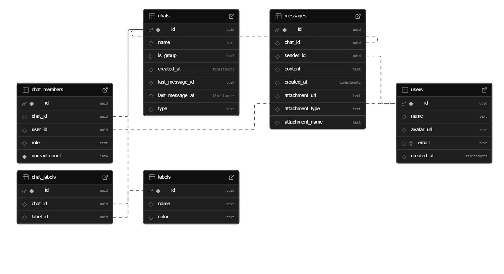
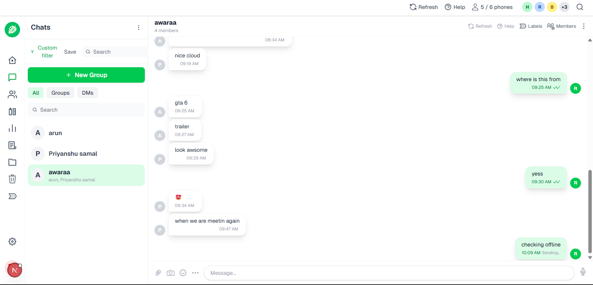

# Chat App

> **Live Demo:** _[Add your live link here]_  
> **Screenshots:**
> 
> 
> 

---

## 🚀 Project Aim
A modern, real-time chat application built with **Next.js**, **Tailwind CSS**, and **Supabase**. The app supports:
- Direct messages (DMs) and group chats
- Real-time messaging
- User authentication
- Chat filters, search, and labels
- Member management with admin roles
- Semantic HTML for accessibility
- (Optional) Attachments and offline support

---

## ✨ Features
- **Authentication:** Secure login/signup with Supabase Auth
- **Real-time Messaging:** Instant updates using Supabase Realtime
- **Group Chats & DMs:** Create, join, and manage group or direct chats
- **Chat Filters & Search:** Filter by type (DM/Group), labels, and search by name/participant
- **Labels:** Create, assign, and remove labels for chats (admin only)
- **Member Management:** Add/remove members, assign admin/member roles (admin only)
- **Semantic HTML:** Uses semantic tags for accessibility and SEO
- **Responsive UI:** Built with Tailwind CSS for a modern look
- **(Optional) Attachments:** Send images, videos, and files in chat
- **(Optional) Offline Support:** IndexedDB for local message storage

---

## 🛠️ Tech Stack
- **Next.js** (App Router)
- **React**
- **Tailwind CSS**
- **Supabase** (Auth, Database, Realtime, Storage)
- **TypeScript**
- **Modern Semantic HTML**

---

## 🏁 Getting Started

### 1. **Clone the Repository**
```bash
git clone https://github.com/your-username/your-repo.git
cd your-repo
```

### 2. **Install Dependencies**
```bash
npm install
```

### 3. **Configure Supabase**
- Create a project at [supabase.com](https://supabase.com)
- Copy your Supabase URL and anon/public key
- Create a `.env.local` file:
  ```env
  NEXT_PUBLIC_SUPABASE_URL=your-supabase-url
  NEXT_PUBLIC_SUPABASE_ANON_KEY=your-anon-key
  ```
- Run Supabase migrations (see `/supabase` folder if present)

### 4. **Run the App**
```bash
npm run dev
```
Visit [http://localhost:3000](http://localhost:3000)

---

## 👤 User Guide
- **Sign Up / Login:** Create an account or log in with email/password
- **Chat List:** See all your DMs and group chats
- **Search & Filter:** Use the search bar and filter buttons to find chats
- **Start a Chat:** Click a user to start a DM, or create a group
- **Send Messages:** Type and send messages in real time
- **Labels:** (Admins) Create and assign labels to organize chats
- **Member Management:** (Admins) Add/remove members, assign admin/member roles
- **Attachments:** (If enabled) Upload and send files/images

---

## 👥 Groups, Membership, and Roles
- **Groups:** Any user can create a group chat and invite others
- **Roles:**
  - **Admin:** Can add/remove members, assign roles, manage labels
  - **Member:** Can send/receive messages, view members
- **Labels:** Only admins can create/assign/remove labels
- **Flags:** (If implemented) Special tags for important chats

---

## 🗄️ Supabase Usage
- **Auth:** Handles user sign up, login, and session management
- **Database:** Stores users, chats, messages, chat_members, labels, chat_labels
- **Realtime:** Listens for new messages, chat changes, and updates UI instantly
- **Storage:** (If enabled) Stores attachments (images, videos, files)

---

## ♿ Semantic HTML & Accessibility
- Uses `<main>`, `<nav>`, `<aside>`, `<section>`, `<header>`, `<ul>`, `<li>`, `<form>`, etc.
- Accessible labels and ARIA attributes for screen readers
- Keyboard navigation supported

---

## 🤝 Contributing
Pull requests are welcome! For major changes, open an issue first to discuss what you would like to change.

---

## 💡 Extras
- **Performance:** Optimized for fast, real-time updates
- **Security:** Row-level security (RLS) enabled in Supabase
- **Modern UI:** Pixel-perfect, responsive design
- **Extensible:** Easy to add new features (reactions, threads, etc.)

---

## Group Chat Admin Logic

### How Group Admins Work
- **The user who creates a group is automatically assigned the role of 'admin'.**
- **All other users added to the group are assigned the role of 'member'.**
- **Only admins can add/remove members or promote/demote other members to admin.**
- **This is enforced both in the UI and in the backend logic.**

### How It Works in Code
When a group is created, the following logic is used to add members:

```ts
// Add members (current user as admin + selected users as members)
const members = [
  { chat_id: chatData.id, user_id: currentUserId!, role: 'admin' },
  ...selectedUserIds.map((id) => ({ chat_id: chatData.id, user_id: id, role: 'member' }))
];
await supabase.from('chat_members').insert(members);
```
- The group creator (`currentUserId`) is always added as an admin.
- All other selected users are added as members.

### Member Management
- In the group member management UI, only users with the 'admin' role can:
  - Add new members
  - Remove members
  - Change the role of other members (promote/demote)
- Regular members cannot manage other members or roles.

### Why This Matters
- This ensures that every group always has at least one admin (the creator by default).
- Only trusted users (admins) can manage the group membership and roles.

### Customization
- You can further restrict role changes (e.g., prevent the last admin from demoting themselves) by adding additional checks in the member management logic.

---

## 📎 File and Image Uploads

### How Attachments Work
- **Users can upload and send images, videos, documents, and audio files in any chat.**
- **Supported file types:**
  - Images: JPEG, PNG, GIF, WebP
  - Videos: MP4, WebM, OGG
  - Documents: PDF, DOC, DOCX
  - Audio: MP3, WAV, OGG
- **File size limit:** 10MB per file
- **Where files are stored:** All attachments are uploaded to [Supabase Storage](https://supabase.com/docs/guides/storage).

### How to Use
- Click the 📎 (paperclip) or 📷 (camera) icon in the message input area to select a file or image.
- The file is uploaded to Supabase Storage and a message with the attachment is sent to the chat.
- **Images** are displayed as previews in the chat. Click to view full size.
- **Other files** (PDFs, docs, etc.) are shown as clickable links with an icon and filename.

### Example Code (Upload Logic)
```ts
// Utility function for uploading a file to Supabase Storage
export async function uploadFile(file: File, chatId: string): Promise<UploadedFile | null> {
  // ...validation and type checks...
  const filePath = `chats/${chatId}/${file.name}`;
  const { data, error } = await supabase.storage
    .from('attachments')
    .upload(filePath, file, { cacheControl: '3600', upsert: false });
  if (error) throw error;
  // Get public URL
  const { data: { publicUrl } } = supabase.storage
    .from('attachments')
    .getPublicUrl(filePath);
  return { url: publicUrl, type: fileType, name: file.name };
}
```

### How It Looks in Chat
- Images appear as thumbnails/previews.
- Other files show as links with an icon and filename.
- All users in the chat can download/view attachments.

### Security
- Only authenticated users can upload files.
- Anyone with the link can view/download files (public bucket).
- File type and size are validated before upload.

---
## 📴 Offline Support & IndexedDB Caching

 

### How Offline and Browser Caching Works

- **Instant Loading:**
  - All chats and messages are cached in the browser using [IndexedDB](https://developer.mozilla.org/en-US/docs/Web/API/IndexedDB_API).
  - When you open the app, chats and messages load instantly from the local database, even before the network fetch completes.

- **Offline Access:**
  - You can view your chats and messages even when you are completely offline.
  - The app will show the most recently cached data from your last online session.

- **Offline Message Sending:**
  - If you send a message while offline, it is immediately added to the chat UI with a "Sending…" status.
  - The message is stored in an IndexedDB queue (`pending_messages` store) with a temporary ID and marked as `pending`.
  - When you come back online, the app automatically syncs all pending messages to the server (Supabase), updates their status to `sent`, and replaces the temporary ID with the real one from the server.
  - If a message fails to send, it is marked as `failed` and can be retried.

- **No Duplicate Sending:**
  - The app ensures that only messages with status `pending` are synced when you come back online.
  - Once a message is successfully sent, it is removed from the pending queue, so it is never sent more than once.

### Technical Overview

- **IndexedDB Utility (`src/utils/indexedDb.ts`):**
  - Stores chats, messages, and a queue of pending messages.
  - Functions:
    - `saveChats`, `getChats`: Cache and retrieve chat lists.
    - `saveMessages`, `getMessagesByChatId`: Cache and retrieve messages for each chat.
    - `addPendingMessage`, `getPendingMessages`, `updatePendingMessageStatus`: Manage the offline message queue.

- **Conversation Component (`src/components/Conversation.tsx`):**
  - On app load, messages are loaded from IndexedDB for instant display.
  - When sending a message:
    - The message is always added to IndexedDB and the UI, even if offline.
    - If online, the message is sent to Supabase immediately.
    - If offline, the message is queued and shown as "Sending…".
  - When the app comes back online, all pending messages are synced to Supabase and their status is updated in the UI.
  - Only messages with status `pending` are synced, preventing duplicates.

### User Experience

- **Fast:** Messages and chats appear instantly, even on slow or unreliable connections.
- **Reliable:** You can send messages and use the app even when offline; everything syncs automatically when you reconnect.
- **Seamless:** The UI clearly shows which messages are pending, sent, or failed, so you always know the status of your chat.

---

